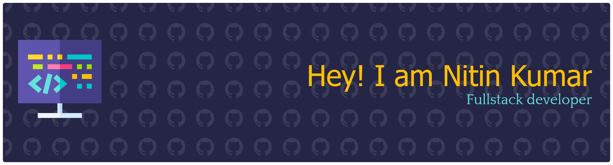

  

<h1 align="center">Hi 👋, I'm Nitin Kumar</h1>
<h3 align="center">💻 Full Stack Developer | MERN Stack | DSA Enthusiast</h3>

---

---

## 🚀 About Me

- 🎓 B.Tech CSE (AI) student at **KIET Group of Institutions**
- 💻 Building scalable **Full Stack (MERN) applications**
- 🧠 Strong in **Data Structures, Algorithms & Core CS**
- ⚡ Experienced with **REST APIs, Authentication & Backend Systems**
- 🎯 Preparing for **Software Engineering Placements**

---

## 🛠 Tech Stack

### 👨‍💻 Programming Languages

---

### ⚙️ Full Stack Development

---

### 🧰 Tools

---

## 📈 GitHub Streak

---

## 🧠 Problem Solving Profiles

---

## 🚀 Projects

### 🔹 Full-Stack Blog Platform
- Built using **React, Redux Toolkit, Appwrite, Tailwind CSS**
- Implemented **Authentication & Role-Based Access Control (RBAC)**
- Integrated **Realtime Database Updates**
- Optimized API calls → improved performance by ~25%

---

### 🔹 Video Sharing & Social Platform (MERN)
- Developed using **MongoDB, Express, React, Node.js**
- Features: **Upload, Like, Comment, Subscribe**
- Implemented **JWT Authentication & Bcrypt Security**
- Integrated **Cloudinary CDN → 30% faster media loading**

---

## 🧠 Core Skills

- Data Structures & Algorithms  
- Object-Oriented Programming (OOP)  
- DBMS, Operating Systems, Computer Networks  
- REST API Development & Authentication  

---

## 🏆 Experience

- 👨‍🏫 Mentored **500+ students** as Student Mentor  
- 🎤 Conducted **technical workshops on web development**  
- 🤝 Improved collaboration using **Git workflows**

---

## 📜 Certifications

- React.js – Scaler  
- Node.js – Simplilearn  
- Cybersecurity Foundation – Palo Alto  

---

## 🚀 Current Focus

- 📚 Advanced **DSA**
- ⚡ Building **Scalable MERN Applications**
- 🧠 Learning **System Design**
- 🎯 Targeting **Product-Based Companies**

---

## 📫 Connect With Me

---

⭐ *“Err and err and err again, but less and less.”*
